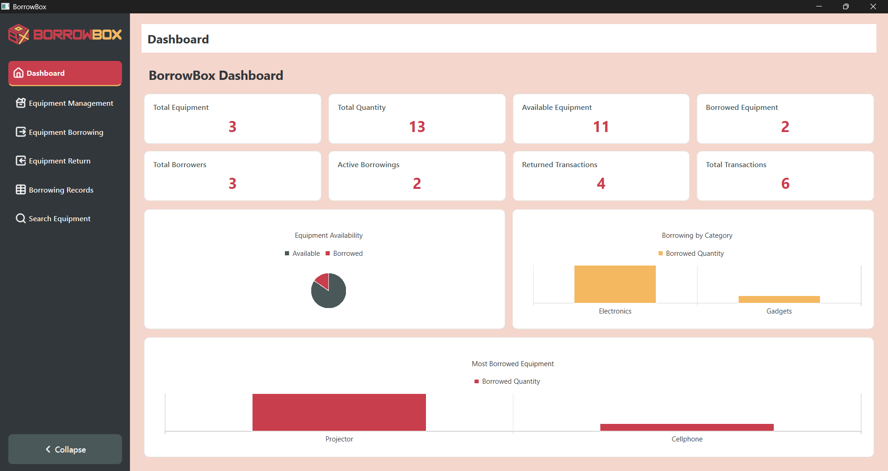
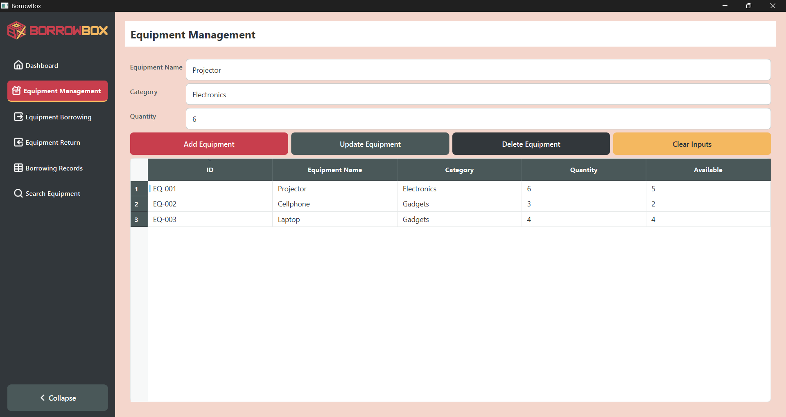
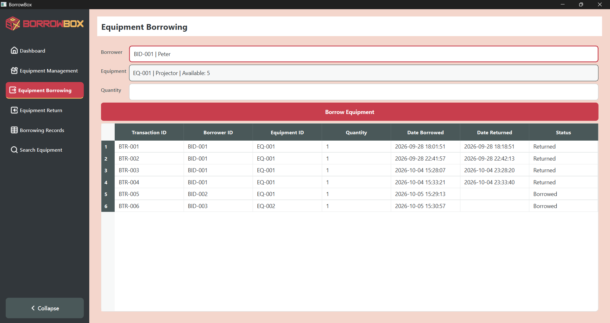
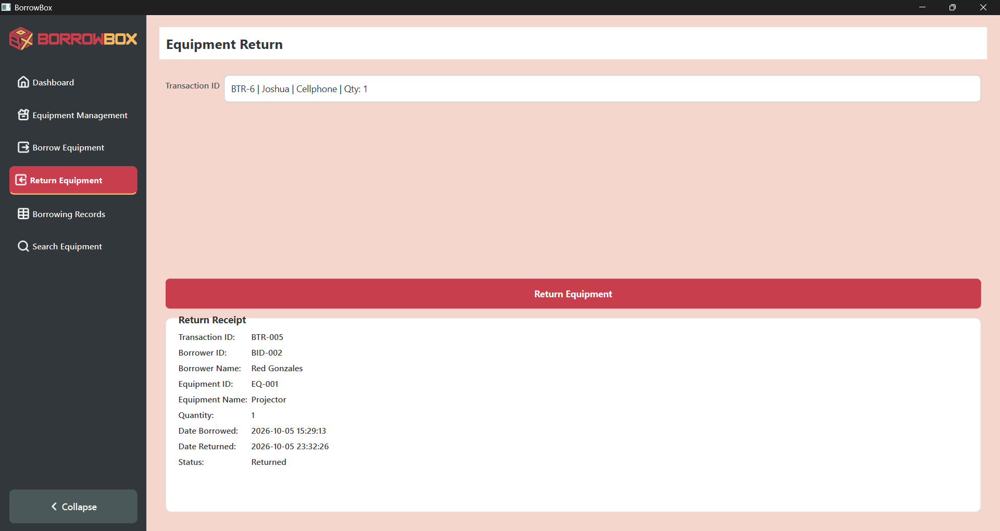
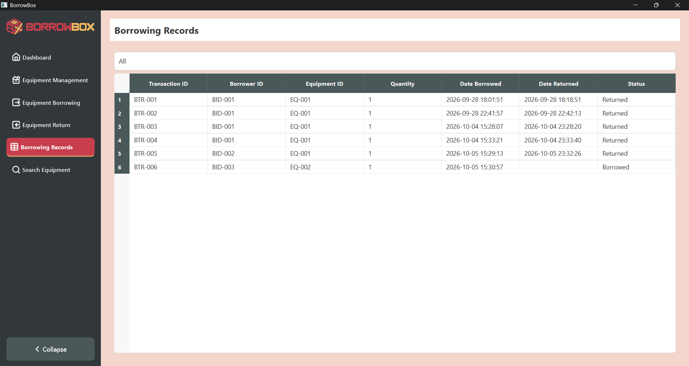
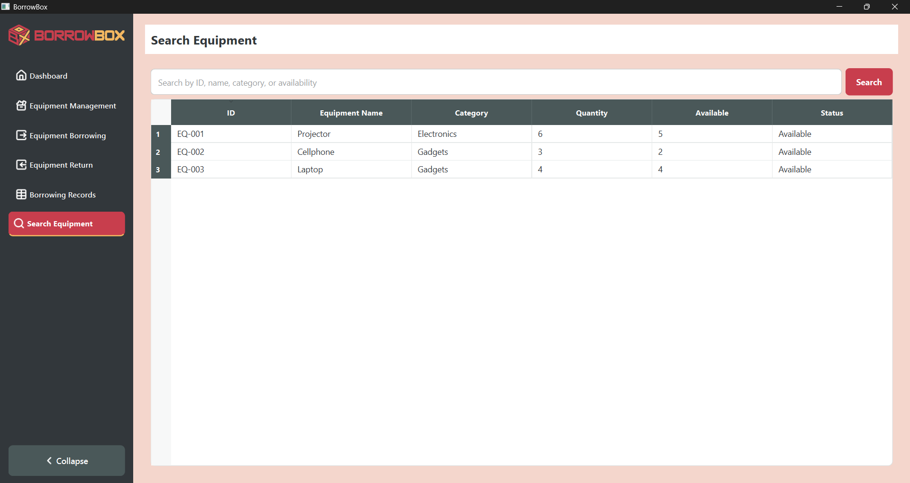
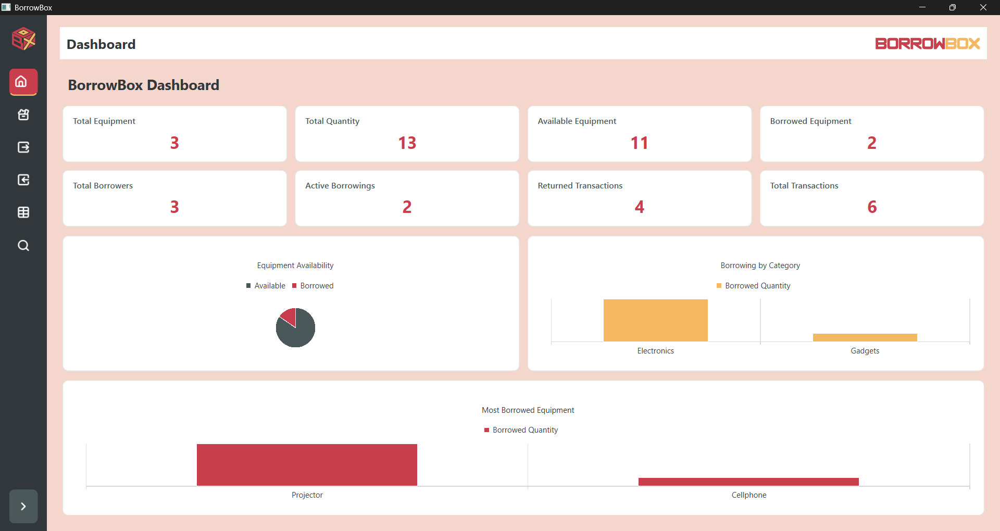

# BorrowBox: Equipment Borrowing and Tracking Management System

BorrowBox is a desktop-based equipment borrowing and tracking management system developed using Python and PyQt6. It provides a graphical interface for managing equipment, recording borrowing transactions, processing equipment returns, and monitoring borrowing activities through a dashboard.


# Project Description

### Overview

**BorrowBox: Equipment Borrowing and Tracking Management System** is a desktop application designed to help organizations manage equipment borrowing and return transactions in an organized and efficient way.

The system allows users to:
* Manage equipment records
* Track equipment quantities and availability
* Manage borrower information
* Record equipment borrowing transactions
* Process equipment returns
* Track borrowing records
* Search for equipment
* Monitor system information through a dashboard
* Sort information displayed in tables

The application uses **SQLite** for data storage and **PyQt6** for its graphical user interface.

### Problem Addressed

Manual equipment borrowing systems can make it difficult to keep track of available equipment, borrowers, and transaction records. Using paper-based records or spreadsheets may also result in duplicated equipment records, inaccurate availability information, and difficulty locating previous transactions.

BorrowBox addresses these problems by providing a centralized system that stores equipment, borrower, and borrowing information in a database. The application automatically updates equipment availability when equipment is borrowed or returned.


# Project Objectives

The main objectives of BorrowBox are to:
1. Develop a user-friendly desktop application for equipment borrowing and tracking.
2. Provide a centralized database for storing equipment, borrower, and transaction records.
3. Allow users to add, update, delete, and manage equipment information.
4. Track the quantity and availability of equipment.
5. Record equipment borrowing transactions.
6. Provide an organized process for returning borrowed equipment.
7. Allow users to search and sort equipment records efficiently.
8. Provide borrowing statistics through a dashboard.
9. Reduce errors associated with manual equipment tracking.
10. Apply object-oriented programming, modular programming, database management, and GUI development concepts in a practical software project.


# Features

### 1. Dashboard

The dashboard provides an overview of the current state of the equipment borrowing system.

It displays statistics such as:
* Total Equipment
* Total Quantity
* Available Equipment
* Borrowed Equipment
* Total Borrowers
* Active Borrowings
* Returned Transactions
* Total Transactions

---

### 2. Equipment Management

The Equipment Management feature allows users to manage equipment records.

Users can:
* Add equipment
* Update equipment information
* Delete equipment
* View equipment records
* Select equipment from the table
* Track total quantity
* Track currently available quantity
* Prevent duplicate equipment records
* Sort table columns

Equipment records use formatted IDs such as:
```text
EQ-001
EQ-002
EQ-003
```

---

### 3. Equipment Borrowing

The Equipment Borrowing feature allows users to record equipment borrowing transactions.

Users can:
* Select an existing borrower
* Add a new borrower
* Select available equipment
* Specify the borrowing quantity
* Validate equipment availability
* Create a borrowing transaction
* View recent borrowing records

Borrower IDs use the format:
```text
BID-001
BID-002
BID-003
```

Transaction IDs use the format:
```text
BTR-001
BTR-002
BTR-003
```

The system automatically reduces the available equipment quantity when a borrowing transaction is created.

---

### 4. Equipment Return

The Equipment Return feature allows users to return equipment based on an active borrowing transaction.

Users can:
* Select an active transaction
* View transaction information
* Return borrowed equipment
* View a return receipt containing transaction information

The return receipt displays information such as:
* Transaction ID
* Borrower ID
* Borrower Name
* Equipment ID
* Equipment Name
* Quantity
* Date Borrowed
* Date Returned
* Status

---

### 5. Borrowing Records

The Borrowing Records feature provides a complete view of borrowing transactions.

Users can:
* View borrowing transactions
* Filter records by status
* View borrowed and returned transactions
* Sort table columns

Available status filters include:
* All
* Borrowed
* Returned

---

### 6. Search Equipment

The Search Equipment feature allows users to search for equipment records.

Searches can be performed using information such as:
* Equipment ID
* Equipment name
* Category
* Availability

The results display:
* Equipment ID
* Equipment Name
* Category
* Quantity
* Available Quantity
* Status

Equipment can also be sorted using the table headers.


# Technologies Used

| Technology       | Purpose                                 |
| ---------------- | --------------------------------------- |
| **Python 3.11**  | Main programming language               |
| **PyQt6**        | Graphical user interface framework      |
| **PyQt6-Charts** | Dashboard charts and data visualization |
| **SQLite3**      | Local database management               |
| **QSS**          | Application and component styling       |
| **PyCharm**      | Development environment                 |
| **Git / GitHub** | Source code version control             |

### Python Standard Library

The project also uses Python's built-in modules, including:

* sqlite3
* pathlib
* datetime
* dataclasses

These modules do not require separate installation.


# Project Structure

The project follows a modular structure where each major feature has its own folder containing its model, repository, service, view, and stylesheet.

```text
BorrowBox/
│
├── assets/
│   ├── icons/
│   └── logo/
│
├── database/
│   ├── database.py
│   └── borrowBox.db
│
├── features/
│   │
│   ├── dashboard/
│   │   ├── model.py
│   │   ├── repository.py
│   │   ├── service.py
│   │   ├── style.qss
│   │   └── view.py
│   │
│   ├── equipment_management/
│   │   ├── model.py
│   │   ├── repository.py
│   │   ├── service.py
│   │   ├── style.qss
│   │   └── view.py
│   │
│   ├── equipment_borrowing/
│   │   ├── model.py
│   │   ├── repository.py
│   │   ├── service.py
│   │   ├── style.qss
│   │   └── view.py
│   │
│   ├── equipment_return/
│   │   ├── model.py
│   │   ├── repository.py
│   │   ├── service.py
│   │   ├── style.qss
│   │   └── view.py
│   │
│   ├── borrowing_records/
│   │   ├── model.py
│   │   ├── repository.py
│   │   ├── service.py
│   │   ├── style.qss
│   │   └── view.py
│   │
│   └── search_equipment/
│       ├── model.py
│       ├── repository.py
│       ├── service.py
│       ├── style.qss
│       └── view.py
│
├── .gitignore
├── main.py
├── style.qss
└── README.md
```

### Major Files and Folders

#### `main.py`

The main entry point of the application.

It:
* Initializes the database
* Creates service objects
* Creates the main BorrowBox window
* Initializes the application
* Connects the feature views to the main navigation
* Starts the PyQt6 event loop

#### `database/database.py`

Contains the `Database` class responsible for connecting to SQLite and creating the required database tables.

#### `database/borrowBox.db`

The SQLite database file used to store application data locally.

#### `features/`

Contains the individual modules of the BorrowBox system.

Each feature follows a similar structure:
* model.py - Data models
* repository.py - Database operations
* service.py - Business logic
* view.py - GUI implementation
* style.qss - Feature-specific styling

#### `assets/`

Contains visual resources used by the application.

The `logo/` directory contains:

* logo.svg
* wordmark.svg

The `icons/` directory contains the application's icon resources.

#### `style.qss`

Contains the global application styling.


# Installation and Setup

### Requirements

Before running BorrowBox, install:
* Python 3.11
* PyQt6
* PyQt6-Charts

### Step 1: Clone or Download the Project

Clone the repository using Git:
```bash
git clone https://github.com/FroztByteX/BorrowBox
```

Then navigate to the project directory:
```bash
cd BorrowBox
```

Alternatively, download the project and extract it into a local folder.

### Step 2: Verify Python

Check that Python 3.11 is installed:
```bash
python --version
```

Expected output:
```text
Python 3.11.x
```

### Step 3: Install Dependencies

Install PyQt6:
```bash
pip install PyQt6
```

Install PyQt6-Charts:
```bash
pip install PyQt6-Charts
```

### Step 4: Run the Application

From the BorrowBox project directory, run:
```bash
python main.py
```

The application should open the BorrowBox main window.

### Database Setup

No manual database setup is required.

When the application starts, `database.py` automatically creates the required SQLite tables if they do not already exist.


# How to Use the System

### 1. Dashboard

After launching BorrowBox, the Dashboard provides an overview of the system.

Users can view:
* Equipment statistics
* Borrowing statistics
* Equipment availability
* Borrowing categories
* Most borrowed equipment

---

### 2. Managing Equipment

1. Open **Equipment Management** from the sidebar.
2. Enter the equipment name.
3. Enter the category.
4. Enter the quantity.
5. Click **Add Equipment**.
6. The equipment appears in the equipment table.
7. Select a record from the table to edit it.
8. Modify the information.
9. Click **Update Equipment** to save changes.
10. Select an equipment record and click **Delete Equipment** to remove it.

The system prevents duplicate equipment records.

---

### 3. Borrowing Equipment

1. Open **Equipment Borrowing**.
2. Select an existing borrower from the Borrower dropdown.
3. Alternatively, select **Add New Borrower**.
4. Enter the new borrower's name and contact information.
5. Select available equipment.
6. Enter the quantity to borrow.
7. Click **Borrow Equipment**.
8. The system creates a transaction.
9. The equipment's available quantity is automatically reduced.

The transaction receives an automatically generated ID such as:
```text
BTR-001
```

---

### 4. Returning Equipment

1. Open **Equipment Return**.
2. Select an active borrowing transaction.
3. Click **Return Equipment**.
4. The system verifies the transaction.
5. The transaction is marked as `Returned`.
6. The equipment's available quantity is increased.
7. A return receipt is displayed.
8. A success message confirms the return.

---

### 5. Viewing Borrowing Records

1. Open **Borrowing Records**.
2. Select a status filter:
   * All
   * Borrowed
   * Returned
3. Review the transaction table.
4. Click table headers to sort the records.

---

### 6. Searching Equipment

1. Open **Search Equipment**.
2. Enter an equipment ID, name, category, or availability keyword.
3. Click **Search** or press Enter.
4. Review the matching equipment records.
5. Click a column header to sort the results.


# OOP Implementation

BorrowBox uses object-oriented programming throughout its architecture.

### Classes and Objects

Important classes include:
* `Database`
* `Equipment`
* `Borrower`
* `BorrowRecord`
* `EquipmentManagementService`
* `EquipmentBorrowingService`
* `EquipmentReturnService`
* `BorrowingRecordsService`
* `EquipmentSearchService`
* `DashboardService`
* `EquipmentManagementView`
* `EquipmentBorrowingView`
* `EquipmentReturnView`
* `BorrowingRecordsView`
* `EquipmentSearchView`
* `DashboardView`

Objects of these classes are created and used by the application to manage data, business logic, and the graphical interface.

---

### Encapsulation

Encapsulation is applied by organizing related data and operations inside classes.

For example, the `Database` class contains the database connection and table creation operations:

```python
class Database:
    def __init__(self, database_path: str | Path = "database/borrowBox.db"):
        self.database_path = Path(database_path)

    def connect(self) -> sqlite3.Connection:
        return sqlite3.connect(self.database_path)
```

The application interacts with the database through the `Database` object rather than directly managing database connections throughout the entire application.

Similarly, service classes contain the business logic for their respective features.

---

### Inheritance

Inheritance is used with PyQt6 widgets.

For example:

```python
class EquipmentManagementView(QWidget):
```

`EquipmentManagementView` inherits from `QWidget`.

The application also creates a custom table item class:

```python
class SortableTableWidgetItem(QTableWidgetItem):
```

This class inherits from `QTableWidgetItem` and overrides its comparison behavior to support appropriate sorting of IDs, quantities, and other values.

---

### Polymorphism

Polymorphism is demonstrated through the customized `__lt__()` method in `SortableTableWidgetItem`.

The class provides its own comparison behavior while still being used as a `QTableWidgetItem`.

```python
def __lt__(self, other):
    ...
```

This allows table items to behave differently when Qt performs sorting while maintaining compatibility with the base `QTableWidgetItem` class.

---

### Composition

The project also uses composition between its components.

For example:

```text
View
  ↓
Service
  ↓
Repository
  ↓
Database
```

A feature view uses its service object, the service uses its repository, and the repository communicates with the database.

This keeps the application organized and separates responsibilities between components.


# Database

BorrowBox uses **SQLite3** as its database management system.

The database is stored locally in:

```text
database/borrowBox.db
```

The database is initialized automatically when the application starts.

---

### 1. `equipments` Table

The `equipments` table stores information about available equipment.

| Column      | Description                     |
| ----------- | ------------------------------- |
| `id`        | Unique equipment ID             |
| `name`      | Equipment name                  |
| `category`  | Equipment category              |
| `quantity`  | Total number of equipment items |
| `available` | Number currently available      |

---

### 2. `borrowers` Table

The `borrowers` table stores information about people who borrow equipment.

| Column    | Description                    |
| --------- | ------------------------------ |
| `id`      | Unique borrower ID             |
| `name`    | Borrower's name                |
| `contact` | Borrower's contact information |

---

### 3. `borrow_records` Table

The `borrow_records` table stores equipment borrowing transactions.

| Column          | Description                |
| --------------- | -------------------------- |
| `id`            | Unique transaction ID      |
| `borrower_id`   | ID of the borrower         |
| `equipment_id`  | ID of the equipment        |
| `quantity`      | Quantity borrowed          |
| `date_borrowed` | Date and time of borrowing |
| `date_returned` | Date and time of return    |
| `status`        | Current transaction status |

The table uses foreign keys to connect borrowing records with borrowers and equipment.

```text
borrowers
    │
    │ borrower_id
    ▼
borrow_records
    ▲
    │ equipment_id
    │
equipments
```

---

### 4. Database Operations

BorrowBox performs the following major database operations:

#### Create

New equipment, borrowers, and borrowing transactions can be created.

Examples include:
* Adding equipment
* Adding borrowers
* Creating borrowing records

#### Read

The application retrieves records to display information such as:
* Equipment lists
* Borrowers
* Borrowing records
* Active transactions
* Dashboard statistics

#### Update

The system updates information such as:
* Equipment information
* Available equipment quantity
* Transaction status
* Return dates

#### Delete

Equipment records can be deleted through the Equipment Management feature.

#### Search

Equipment records can be searched based on available equipment information such as:
* ID
* Name
* Category
* Availability


# Screenshots

### Dashboard



*Figure 1. BorrowBox Dashboard showing equipment and borrowing statistics.*

---

### Equipment Management



*Figure 2. Equipment Management interface for adding, updating, deleting, and viewing equipment.*

---

### Equipment Borrowing



*Figure 3. Equipment Borrowing interface for selecting borrowers, equipment, and borrowing quantities.*

---

### Equipment Return



*Figure 4. Equipment Return interface showing active transactions and the return receipt.*

---

### Borrowing Records



*Figure 5. Borrowing Records interface showing borrowing and return transactions.*

---

### Search Equipment



*Figure 6. Search Equipment interface for finding equipment records.*

---

### Collapsed Sidebar



*Figure 7. BorrowBox interface with the sidebar collapsed.*


# Testing

The following test cases can be used to verify the major functions of BorrowBox.

### 1. Equipment Management Tests

| Test Case                           | Expected Result                              | Actual Result                    | Status |
| ----------------------------------- | -------------------------------------------- | -------------------------------- | ------ |
| Add valid equipment                 | Equipment is added to the database and table | Equipment is added and displayed | Passed |
| Add duplicate equipment             | System prevents duplicate equipment          | Duplicate equipment is rejected  | Passed |
| Add equipment with invalid quantity | System displays an error message             | Validation error is displayed    | Passed |
| Update equipment                    | Selected equipment information is updated    | Equipment information is updated | Passed |
| Delete equipment                    | Selected equipment is removed                | Equipment is deleted             | Passed |
| Sort equipment table                | Table records are sorted by selected column  | Records can be sorted            | Passed |

### 2. Equipment Borrowing Tests

| Test Case                           | Expected Result                       | Actual Result                     | Status |
| ----------------------------------- | ------------------------------------- | --------------------------------- | ------ |
| Borrow available equipment          | Transaction is created                | Borrowing transaction is created  | Passed |
| Borrow more than available quantity | System rejects the transaction        | Borrowing is rejected             | Passed |
| Borrow zero or negative quantity    | System rejects the transaction        | Validation message is displayed   | Passed |
| Add new borrower                    | New borrower is created               | Borrower is created               | Passed |
| Select existing borrower            | Existing borrower can be used         | Borrower can be selected          | Passed |
| Borrow unavailable equipment        | Equipment cannot be selected/borrowed | Unavailable equipment is excluded | Passed |

### 3. Equipment Return Tests

| Test Case                           | Expected Result                                            | Actual Result                                 | Status |
| ----------------------------------- | ---------------------------------------------------------- | --------------------------------------------- | ------ |
| Return active transaction           | Transaction becomes Returned                               | Transaction is marked Returned                | Passed |
| Return equipment                    | Available quantity increases                               | Available quantity increases                  | Passed |
| Return already returned transaction | System prevents duplicate return                           | Returned transaction cannot be returned again | Passed |
| No active transactions              | System indicates that no active transactions are available | Message is displayed                          | Passed |

### 4. Borrowing Records Tests

| Test Case        | Expected Result                         | Actual Result                  | Status |
| ---------------- | --------------------------------------- | ------------------------------ | ------ |
| View all records | All borrowing records are displayed     | Records are displayed          | Passed |
| Filter Borrowed  | Only active borrowing records are shown | Borrowed records are displayed | Passed |
| Filter Returned  | Only returned records are shown         | Returned records are displayed | Passed |
| Sort records     | Records can be sorted by columns        | Sorting works                  | Passed |

### 5. Search Tests

| Test Case                | Expected Result                         | Actual Result                     | Status |
| ------------------------ | --------------------------------------- | --------------------------------- | ------ |
| Search by equipment name | Matching equipment is displayed         | Matching records are displayed    | Passed |
| Search by category       | Matching category records are displayed | Matching records are displayed    | Passed |
| Search by equipment ID   | Matching equipment is displayed         | Matching equipment is displayed   | Passed |
| Search with no match     | No matching records are displayed       | No matching records are displayed | Passed |

### 6. Navigation and Interface Tests

| Test Case                 | Expected Result                          | Actual Result                  | Status |
| ------------------------- | ---------------------------------------- | ------------------------------ | ------ |
| Open Dashboard            | Dashboard is displayed                   | Dashboard is displayed         | Passed |
| Navigate between features | Selected feature is displayed            | Navigation works               | Passed |
| Collapse sidebar          | Sidebar changes to collapsed state       | Sidebar collapses              | Passed |
| Expand sidebar            | Sidebar returns to expanded state        | Sidebar expands                | Passed |
| Open application          | Main BorrowBox window loads successfully | Application opens successfully | Passed |


# Known Issues / Limitations

The current version of BorrowBox has the following limitations:

### a. No Borrowing Deadline

The current system does not yet assign a deadline to borrowed equipment.

### b. No Fine Calculation

The system does not currently calculate fines for late equipment returns.

### c. No Printed Borrowing Receipt

The system currently provides transaction and return information through the application interface, but printing of a formal borrowing receipt has not yet been implemented.

### d. Local Database

The application uses a local SQLite database. It is not currently configured as a multi-user network-based system.

### e. No User Authentication

The current version does not include user login or account management.

### f. No Requirements File

The project does not currently contain a `requirements.txt` file. Dependencies must therefore be installed manually using `pip`.

### g. Desktop Application

BorrowBox is currently designed as a desktop application using PyQt6 and is not available as a web or mobile application.


# Future Improvements

Potential future improvements include:
* Borrowing deadlines
* Automatic late-return detection
* Fine calculation
* Printable borrowing receipts
* Printable return receipts
* User authentication
* User roles and permissions
* More advanced reports
* Exporting records to files
* Improved database deployment for multiple users
* Automated dependency management using `requirements.txt`

These features are **not part of the current implementation**.


# Author

- **Name:** John Peter A. Padillo
- **Section:** CS26L(3581)